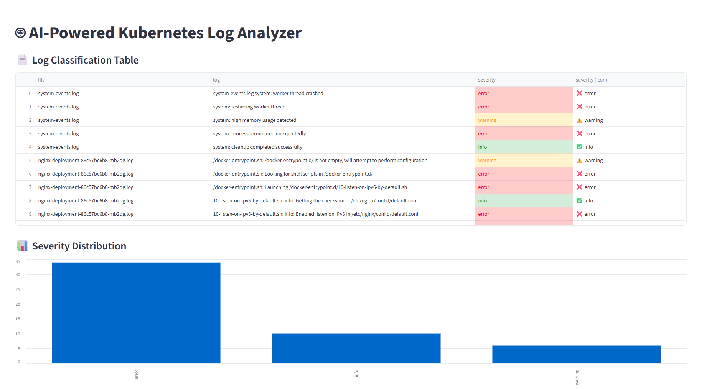

# 🤖 AI-Powered Kubernetes Log Analyzer

An interactive Streamlit dashboard that uses machine learning to classify Kubernetes pod logs into `error`, `warning`, and `info` levels — helping you quickly identify and investigate issues in your workloads.



## 🚀 Features

- Automatically loads `.log` or `.txt` files from the `sample_logs/` directory
- Uses machine learning (Logistic Regression) to classify logs
- Color-coded table with ✅ info, ⚠️ warning, ❌ error labels
- Bar chart showing severity distribution
- Upload your own logs or use collected pod logs

## 🛠️ Tech Stack

- Python 3.x
- Streamlit
- scikit-learn
- Kubernetes
- Optional: Minikube or AWS EKS

## 📁 Project Structure

kube-log-ai-analyzer/
├── dashboard.py
├── collect_logs.py
├── train_model.py
├── train.csv
├── log_classifier.pkl
├── sample_logs/
├── requirements.txt
├── .gitignore
└── README.md
## ⚙️ How to Run

Follow these steps to set up and run the AI-powered Kubernetes log analyzer on your machine or EC2 instance.

---

### 🧱 Step 1: Clone the Repository

```bash
git clone https://github.com/bhanup6/kube-log-ai-analyzer.git
cd kube-log-ai-analyzer
```

---

### 🐍 Step 2: Set Up Python Environment

```bash
python3 -m venv venv
source venv/bin/activate
pip install --upgrade pip
pip install -r requirements.txt
```

---

### 🧠 Step 3: Train the AI Model

Make sure `train.csv` contains your labeled log data in this format:

```csv
log,severity
"nginx started successfully",info
"retrying API call",warning
"disk quota exceeded",error
```

Then train the model:

```bash
python train_model.py
```

> This generates a trained model file: `log_classifier.pkl`

---

### 📥 Step 4: Collect Logs from Kubernetes (Optional)

If you have a Kubernetes cluster (like Minikube or EKS), run:

```bash
python collect_logs.py
```

> This saves logs from your running pods into the `sample_logs/` folder.

**OR** you can manually place `.log` or `.txt` files into the `sample_logs/` directory.

---

### 🖥️ Step 5: Run the Dashboard

```bash
streamlit run dashboard.py
```

Then open in your browser:

```
http://localhost:8501
```

> If you're running this on an EC2 server, open:
> ```
> http://<your-ec2-public-ip>:8501
> ```

---

### ✅ Quick Start (All in One)

```bash
git clone https://github.com/bhanup6/kube-log-ai-analyzer.git
cd kube-log-ai-analyzer
python3 -m venv venv
source venv/bin/activate
pip install -r requirements.txt
python train_model.py
python collect_logs.py   # optional
streamlit run dashboard.py
```

---

### 🧪 Example Logs

Your `.log` files should contain one log message per line, e.g.:

```log
nginx started successfully
retrying API call
connection refused on port 443
disk quota exceeded
cleanup completed successfully
```

---

That’s it! 🎉 You're now ready to analyze logs using AI!


